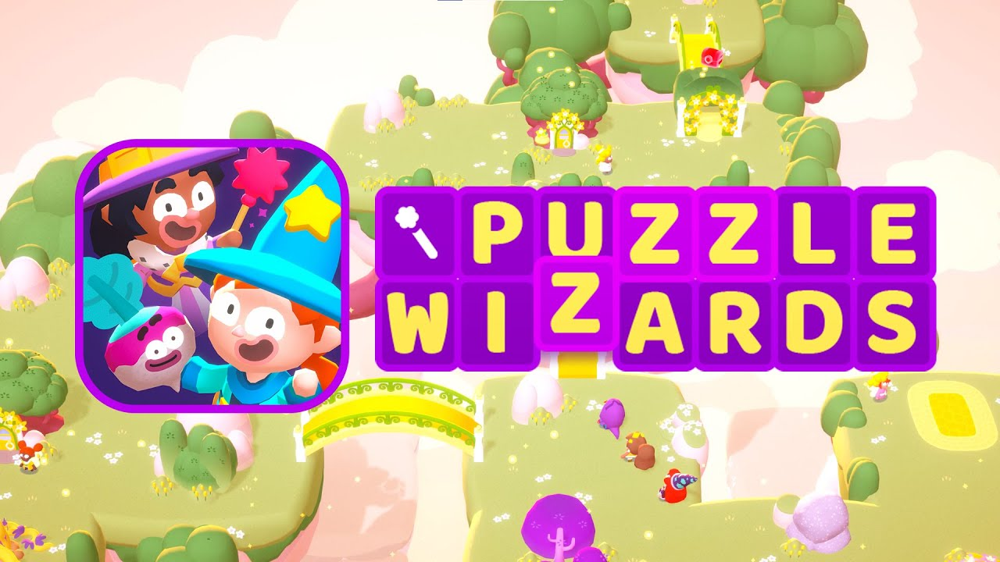

---
# the default layout is 'page'
layout: page
title: Home
permalink: /
---

Welcome to my puzzle wizards wiki where you can find useful information on several aspects of the game!

I wanted to create a knowledge base after learning tips and tricks as a new player.
Hopefully you find this guide useful and go support the devs by downloading and playing the game on mobile/Steam at [Puzzle Wizards](https://puzzlewizards.net/)!

You can find posts by going to the categories tab in the sidebar or by going through the tags.

## Recommended Posts:

  
  
    
    
    <a class="suggested-post-card" href="{{ post.url | relative_url }}">
      {{ post.title }}
      
      {{ post.description }}
      
    </a>
    
  

